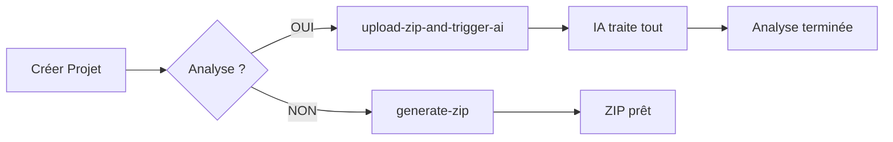

# ⚡ Workflow Endpoints - Résumé Exécutif

## 🎯 **2 Endpoints Principaux à Retenir**

| Endpoint | Usage | Déclenche IA ? |
|----------|-------|----------------|
| **`/api/workflow/generate-zip`** | 📦 Génère seulement le ZIP | ❌ **NON** |
| **`/api/workflow/upload-zip-and-trigger-ai`** | 🚀 Génère ZIP + Lance l'analyse IA | ✅ **OUI** |

## 🔄 **Flux Simple**

## ✅ **Nouveautés Conversation/Fiche**

- 📝 **Champs optionnels** : `conversation` et `fiche` dans `/api/projects`
- 🛡️ **Résilient** : Ignore les champs vides/whitespace automatiquement
- 📦 **Auto-génération** : Fichiers `conversation.txt` et `fiche.txt` dans le ZIP
- 🔧 **Sans interruption** : Les erreurs ne cassent pas le processus

## 🚨 **Attention**

- ⚠️ **`generate-zip`** : ZIP seulement, aucune IA déclenchée
- ⚠️ **`upload-zip-and-trigger-ai`** : ZIP + déclenchement complet de l'IA

---
*Guide complet : [WORKFLOW-ENDPOINTS-GUIDE.md](./WORKFLOW-ENDPOINTS-GUIDE.md)*
